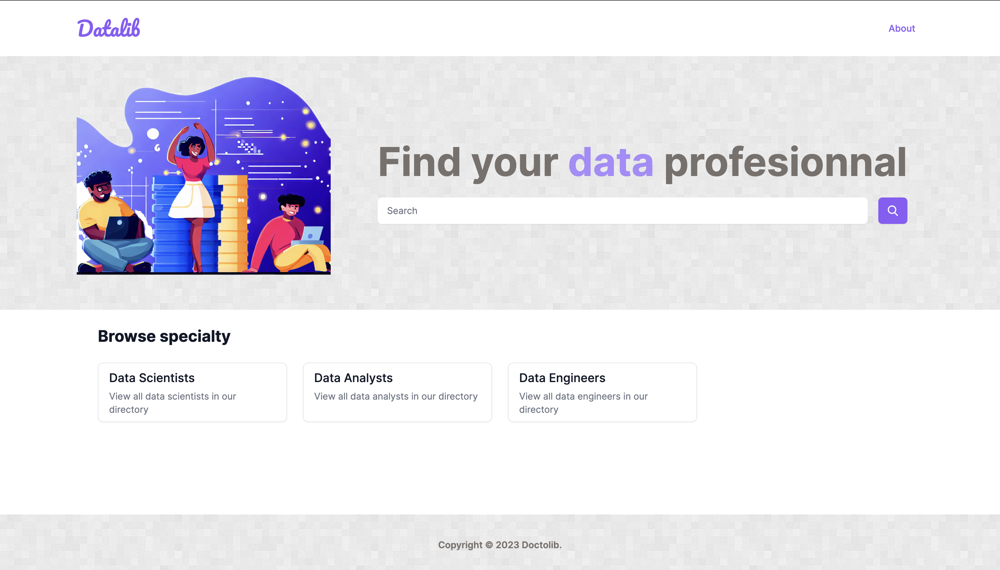

# **Intro to ruby on rails**

_
```ruby
Presenter.new(
  name: "Moustapha Sall",
  team: "🐼"
)
```

---

> Ruby is designed to make programmers happy

_Yukihiro "Matz" Matsumoto_

---

# Agenda

1. Installing ruby with rbenv
2. Intro to ruby syntax
3. Getting started with rails: the MVC pattern
4. Building a "real world" app

---
# Installing [rbenv](https://github.com/rbenv/rbenv)

### Using homebrew
```
brew install rbenv ruby-build
```

### Then
```
rbenv init
```
```
rbenv global 3.2.2
```


---

# Installing ruby and rails

### Install the latest ruby version
```
rbenv install 3.2.2
```

### Install bundler and rails
```
gem install bundler rails
```

---

# What we will be building?

